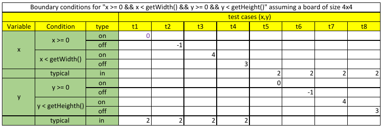
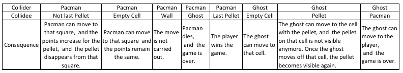
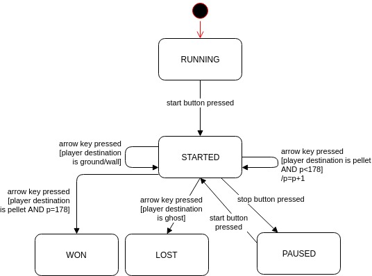
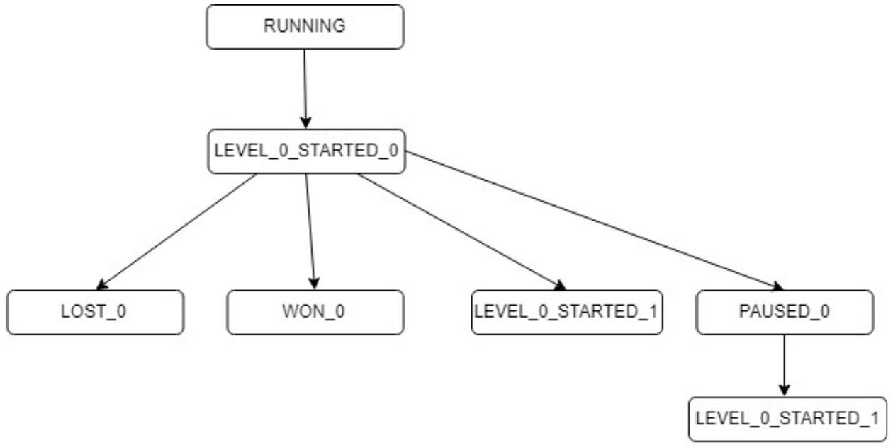
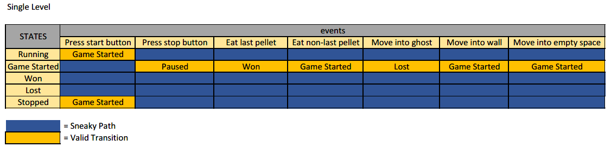
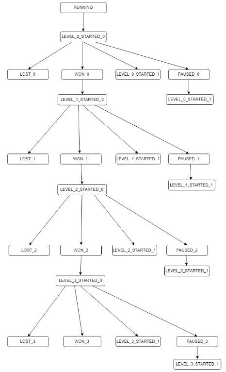
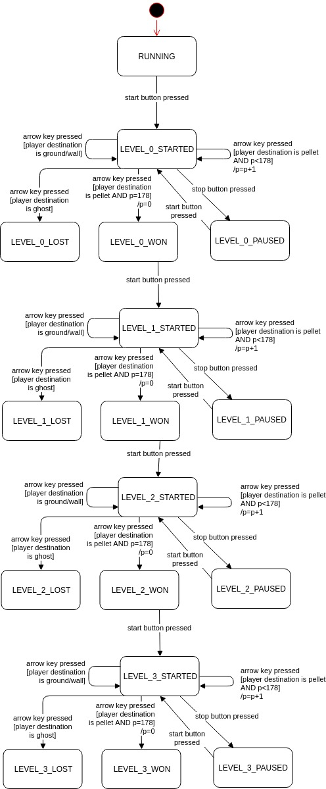
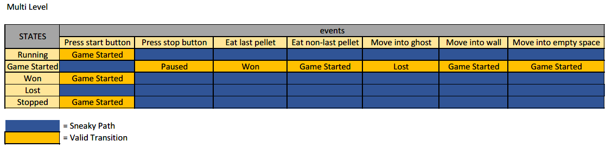

# Software Quality & Testing Report

## Assignment 0

### Question 3

The reason why we can not exhaustively test our entire software project is because even if it does not include many branches, inputs and outputs, it would be realistically impossible to test all possible combinations of input values. Instead we should for example prioritise the combinations of values that are most common or that are most likely to cause faults.

### Question 4

The pesticide paradox says that like a pesticide, testing only gets rid of those bugs that the test cases cover. The consequence of this paradox is that once you have run the same tests over and over again, no new information can be derived as no new bugs will be found. In addition, more subtle bugs will not be detected by these tests. This implies for software testers that we have to constantly write new test cases as we cannot depend on old test cases made a long time ago to find new bugs.

### Question 5

We should automate the test execution process as much as possible because this is the part of the testing process that depends least on human input, is prone to human error, is rather monotonous and thus lends itself best to automation.

## Assignment 1

### Question 6

`DefaultPlayerInteractionMap` and `CollisionInteractionMap`, the code in these classes is not called directly or indirectly by the smoke test. This is because the `DefaultPlayerInteractionMap` is a class meant to enable future extensions to the collision system, but is currently not used. The `CollisionInteractionMap` is in turn only used by this class, therefore it is unused as well.

### Question 7

Yes, it is covered. When commenting out the line that moves the player, the player does not consume the pellet on the square it has moved to, therefore not getting ten points for the pellet. This can be used as an indicator of that fact that indirectly obtaining points by moving on the board functions correctly. It however is of limited use as it does not make clear in what part the defect is present, it covers multiple methods from multiple classes.

### Question 8

This change causes the neighbour maps of the squares to receive the incorrect squares. Specifically for `Direction.EAST`, this results in the east neighbour of a square to be the exact same square. Moving the player to what should be the east will result in it staying on the same square. This in turn causes the player to not get any points, for the reasons established in question 7. Again it was not trivial to establish all this, because the behaviour spans many methods and classes. In conclusion, end-to-end testing such as this is only useful for establishing the presence of faults, not where or under what exact circumstances. More in-depth testing such a unit testing is needed for that.

### Question 9

`Game` together with its concrete implementation `SinglePlayerGame` appears to function as a sort of container that holds most of the other classes either directly or indirectly. It coordinates the communication between these classes and handles the lifecycle of the game - setting it up and tearing it down. `Level` is concerned with the board, the player and the NPCs. It handles collisions between these and can notify other classes that the game has ended. `Board` contains the grid of `Square`s and its dimensions, and enables other classes to obtain squares and check the validity of coordinates. `Unit` is a generic representation of moving characters on the board. It enables the movement of characters across the board.

### Question 12



### Question 14

To avoid code repetition, one can make create a setup method and put into it classes and objects that are required by each test. Then, one can annotate it with either the `@BeforeEach` or the `@BeforeAll` annotations. This ensures that, as the name suggests, before each test instance or once before all test instances, the setup method is run and thus all the required instantiations and setup work is carried out.

### Question 15

The advantages of such an approach is that any changes that happen to a class in one test is not carried over to the next test, thereby preventing unwanted spillover effects that could influence an otherwise accurate test. 
 
### Question 16
 
`assertEquals(1, a)` is better because in case of failure, it would provide the user with more information as to what went wrong, for instance one could learn that 1 was expected but that 3 was actually provided. In the case that `assertTrue(1 == a)` is false, one only learns that this is not the case but there is not more information provided as to why this assert statement is wrong. In addition, assertEquals will call the equals() method whereas `1 == a` does not, therefore depending on the behavior of the `equals()` method.
  
### Question 17
 
A reason not to test private methods is that they are not part of the public interface of the unit (class) that is being tested. Any mistakes in private methods that are used in a certain way by methods that are part of the public interface can be caught by tests for those methods. Because these private methods are always used by other methods, it does not make sense to test them in isolation.
 
### Question 18
 
 Based on our newly created classes, the adequacy of JPACMAN has increased as through our tests it was established that the nextAiMove method of the Clyde and Inky classes and the withinBorders method of the Board class behave as expected. As we only committed code after it was checked by the Checkstyle, PMD and Spotbugs plugin, we never run into troubles with the continuous integration server testing. Finally, we committed and pushed onto a branch for every section of the assignment i.e. once for boundary testing. In addition, we varied who carried out the git interactions.

## Assignment 2

### Question 3

For testing the start method of the game class, we achieved 100% class coverage, 42% method coverage, 54% line coverage and 100% branch coverage.

### Question 4

See figure 2.



### Question 7

Originally, neither the `CollisionInteractionMap` nor the `DefaultPlayerInteractionMap` were tested. What was partially tested was the `PlayerCollisions` class, namely mostly by the `SmokeScreen` test. The only interactions that were tested were between players and ghosts, pellet interactions were not tested.

With the additional new tests all combinations between players, ghosts and pellets are tested, in addition to collisions with units for which no collision behaviour is defined. The behaviour of the `CollisionInteractionMap` is still not directly tested, only indirectly via `DefaultPlayerInteractionMap`. Because of the high complexity of this class dedicated unit tests would be very useful to ensure it functions correctly.

### Question 8

With random numbers, one might be interested in whether or not the distribution is actually random. To test this, one can use fuzzing to generate random input values and then plot the resulting outcome or conduct further distribution analysis.

Another possibility is to instead use the option of the `Random` class to provide a seed for the random number generation. If we for a test always use the same seed, the output of the random number generator will always give the same values. These values or their consequences can then be checked against.

### Question 9

For `LauncherSmokeTest` the flakiness is caused by the partially random movement of the ghosts during the sleep period because of which the death of Pacman is likely but not guaranteed. An indication of this test's flakiness can be seen in that it is quite large.

Tests can become flaky when what it tests does not solely depend on the inputs provided by the test anymore. Especially when external tools are used, larger tests are much more likely to be flaky because they have more moving parts.

### Question 10

No metric is perfect. 100% code coverage does not mean that there are no bugs. Critically thinking about how to discover faults will be more useful than blindly going for 100% code coverage. In certain circumstances, getting a class in the right state and to trigger a condition to observe the resulting outcome might be impossible. An advantage is that is forces the developer to think about what inputs will trigger what behaviour in their code.

A good way to use it instead is to let it guide the focus of testing and inform developers about possible oversights.

### Question 11

A disadvantage of mock objects is that they are tightly coupled to the objects they mock which can lead to  lot of tests breaking when the original object is changed. Another problem is that static methods and objects can not be mocked.  Additionally, mocking involves a lot reflection, which means that mocks can greatly slow down test execution.  Mocking can become very complicated and thus setting up a test can become very complex  i.e. when a mock has to also  return other mocks. Finally, mocking can also lead to code being written solely for testing interactions between classes.

### Question 12

A test suite becomes slower over time because more code needs to be executed meaning more conditions need to be checked, more resources need to be accessed and just generally more code needs to be executed. Additionally, as the code base grows over time, a test can become slower as more and more code needs to be executed for the same test. Also, tests can become more complex and slower because more complex behavior has to be tested, i.e. a system test at the end of a coding process is more complex that one created early on.

### Question 13

Research has shown that people tend to use mocking when testing is difficult due to dependencies, for instance in the case when setting up is difficult or where external resources have to be accessed. The integration test level is particularly suitable for mocking as here it can be used to mock things like a database that would otherwise be difficult to get in the right state.

Using a classes concrete implementation is more frequently used when the developer has more control over the code. In system tests, you never use mocks as you are interested in the actual behavior of the whole code base. Finally, when one is interested in the testing how multiple classes function as a whole, using the concrete implementation makes more sense.

### Question 14

Based on running JPacman for a number of times, we believe these are the issues with the code introduced by the AwesomePointCalculator:

- Pacman dies around a score of 187/230
- The blue ghost does not move (only observed ones)
- The start/stop buttons on the end screen do not work
- The score randomly flips and becomes negative
- Sometimes Pacman does not consumes a pellet but instead floats over one. This is accompanied by a Runtime error that states that we found one of the solutions.

### Question 15

**Abnormality 1**: the score decreases by 15 points when the amount of remaining pellets is 149 or less. If the score is already a very large negative value it does not occur.

Log snapshot of abnormal behaviour:
```
true false WEST NORTH 149 236
true false NORTH NORTH 149 236
true false NORTH WEST 148 221
true false WEST EAST 148 221
true false EAST WEST 148 221
true false WEST NORTH 148 221
true false NORTH NORTH 147 206
true false NORTH SOUTH 146 191
true false SOUTH WEST 146 191
```
Log snapshot of normal behaviour:
```
true false WEST NORTH 149 290
true false NORTH NORTH 149 290
true false NORTH SOUTH 148 300
true false SOUTH SOUTH 148 300
true false SOUTH WEST 148 300
true false WEST WEST 147 310
true false WEST EAST 146 320
true false EAST SOUTH 146 320
```

**Abnormality 2**: a `RuntimeException` mentioning that an abnormality has been triggered is thrown from the `AmazingPointCalculator` and shows up in the error output stream. When this happens Pacman also does not pick up pellets. This is triggered when moving north from one of the bottom corners of the map.

Screenshot of abnormal behaviour:


Screenshot of normal behaviour:


Stacktrace of the exception:

```
Exception in thread "AWT-EventQueue-0" java.lang.RuntimeException: Relax! You found one of the solutions!
	at AmazingPointCalculator.consumedAPellet(AmazingPointCalculator.java:50)
	at nl.tudelft.jpacman.level.PlayerCollisions.playerVersusPellet(PlayerCollisions.java:91)
	at nl.tudelft.jpacman.level.PlayerCollisions.playerColliding(PlayerCollisions.java:51)
	at nl.tudelft.jpacman.level.PlayerCollisions.collide(PlayerCollisions.java:36)
	at nl.tudelft.jpacman.level.Level.move(Level.java:190)
	at nl.tudelft.jpacman.game.Game.move(Game.java:102)
	at nl.tudelft.jpacman.Launcher.lambda$moveTowardsDirection$0(Launcher.java:168)
	at nl.tudelft.jpacman.ui.PacKeyListener.keyPressed(PacKeyListener.java:33)
	at java.desktop/java.awt.Component.processKeyEvent(Component.java:6590)
	at java.desktop/java.awt.Component.processEvent(Component.java:6409)
	at java.desktop/java.awt.Container.processEvent(Container.java:2263)
	at java.desktop/java.awt.Window.processEvent(Window.java:2049)
	at java.desktop/java.awt.Component.dispatchEventImpl(Component.java:5008)
	at java.desktop/java.awt.Container.dispatchEventImpl(Container.java:2321)
	at java.desktop/java.awt.Window.dispatchEventImpl(Window.java:2772)
	at java.desktop/java.awt.Component.dispatchEvent(Component.java:4840)
	at java.desktop/java.awt.KeyboardFocusManager.redispatchEvent(KeyboardFocusManager.java:1950)
	at java.desktop/java.awt.DefaultKeyboardFocusManager.dispatchKeyEvent(DefaultKeyboardFocusManager.java:871)
	at java.desktop/java.awt.DefaultKeyboardFocusManager.preDispatchKeyEvent(DefaultKeyboardFocusManager.java:1140)
	at java.desktop/java.awt.DefaultKeyboardFocusManager.typeAheadAssertions(DefaultKeyboardFocusManager.java:1010)
	at java.desktop/java.awt.DefaultKeyboardFocusManager.dispatchEvent(DefaultKeyboardFocusManager.java:836)
	at java.desktop/java.awt.Component.dispatchEventImpl(Component.java:4889)
	at java.desktop/java.awt.Container.dispatchEventImpl(Container.java:2321)
	at java.desktop/java.awt.Window.dispatchEventImpl(Window.java:2772)
	at java.desktop/java.awt.Component.dispatchEvent(Component.java:4840)
	at java.desktop/java.awt.EventQueue.dispatchEventImpl(EventQueue.java:772)
	at java.desktop/java.awt.EventQueue$4.run(EventQueue.java:721)
	at java.desktop/java.awt.EventQueue$4.run(EventQueue.java:715)
	at java.base/java.security.AccessController.doPrivileged(Native Method)
	at java.base/java.security.ProtectionDomain$JavaSecurityAccessImpl.doIntersectionPrivilege(ProtectionDomain.java:85)
	at java.base/java.security.ProtectionDomain$JavaSecurityAccessImpl.doIntersectionPrivilege(ProtectionDomain.java:95)
	at java.desktop/java.awt.EventQueue$5.run(EventQueue.java:745)
	at java.desktop/java.awt.EventQueue$5.run(EventQueue.java:743)
	at java.base/java.security.AccessController.doPrivileged(Native Method)
	at java.base/java.security.ProtectionDomain$JavaSecurityAccessImpl.doIntersectionPrivilege(ProtectionDomain.java:85)
	at java.desktop/java.awt.EventQueue.dispatchEvent(EventQueue.java:742)
	at java.desktop/java.awt.EventDispatchThread.pumpOneEventForFilters(EventDispatchThread.java:203)
	at java.desktop/java.awt.EventDispatchThread.pumpEventsForFilter(EventDispatchThread.java:124)
	at java.desktop/java.awt.EventDispatchThread.pumpEventsForHierarchy(EventDispatchThread.java:113)
	at java.desktop/java.awt.EventDispatchThread.pumpEvents(EventDispatchThread.java:109)
	at java.desktop/java.awt.EventDispatchThread.pumpEvents(EventDispatchThread.java:101)
	at java.desktop/java.awt.EventDispatchThread.run(EventDispatchThread.java:90)
```

**Abnormality 3**: when the amount of pellets remaining gets below 144 and Pacman moves to a direction that is not north, Pacman dies, even when there is no ghost in any adjacent square.

Log snapshot 1 of abnormal behaviour:
```
true false NORTH EAST 145 176
true false EAST SOUTH 144 161
true false SOUTH EAST 144 161
false false EAST EAST 143 146
```
Log snapshot 2 of abnormal behaviour:
```
true false WEST WEST 145 -2147483348
true false WEST NORTH 144 309
true false NORTH WEST 144 309
false false WEST WEST 143 -2147483355
```
Log snapshot 3 of abnormal behaviour:
```
true false NORTH SOUTH 144 188
true false SOUTH NORTH 144 188
true false NORTH EAST 144 188
false false EAST EAST 143 173
```
Log snapshot 1 of normal behaviour:
```
true false NORTH EAST 144 340
true false EAST SOUTH 143 350
true false SOUTH EAST 143 350
true false EAST NORTH 142 360
true false NORTH EAST 142 360
true false EAST WEST 141 370
true false WEST SOUTH 141 370
true false SOUTH NORTH 141 370
true false NORTH SOUTH 141 370
```
Log snapshot 2 of normal behaviour:
```
true false EAST WEST 143 350
true false WEST NORTH 143 350
true false NORTH WEST 143 350
true false WEST EAST 143 350
true false EAST SOUTH 143 350
true false SOUTH EAST 143 350
true false EAST NORTH 143 350
true false NORTH WEST 142 360
true false WEST NORTH 142 360
```
**Abnormality 4**: when the amount of pellets remaining gets below 163 and Pacman moves west, then a very large number is added to the score that causes an integer overflow error. 

Log snapshot 1 of abnormal behaviour:
```
true false WEST WEST 163 150
true false WEST EAST 162 -2147483489
true false EAST WEST 162 -2147483489
true false WEST WEST 162 -2147483489
true false WEST WEST 162 -2147483489
true false WEST SOUTH 161 168
```
Log snapshot 2 of abnormal behaviour:
```
true false SOUTH WEST 160 180
true false WEST SOUTH 159 -2147483459
true false SOUTH SOUTH 159 -2147483459
true false SOUTH WEST 159 -2147483459
true false WEST NORTH 158 198
```
Log snapshot 3 of abnormal behaviour:
```
true false NORTH WEST 153 250
true false WEST NORTH 152 -2147483389
true false NORTH SOUTH 152 -2147483389
true false SOUTH WEST 152 -2147483389
true false WEST NORTH 151 268
```
Log snapshot 1 of normal behavior
```
true false NORTH NORTH 164 140
true false NORTH WEST 163 150
true false WEST SOUTH 163 150
true false SOUTH EAST 163 150
```
Log snapshot 2 of normal behavior
```
true false SOUTH SOUTH 164 140
true false SOUTH SOUTH 163 150
true false SOUTH WEST 162 160
true false WEST WEST 162 160
true false WEST EAST 162 160
true false EAST EAST 162 160
true false EAST EAST 162 160
true false EAST EAST 162 160
true false EAST SOUTH 162 160
true false SOUTH SOUTH 161 170
```
Log snapshot 3 of normal behavior
```
true false WEST NORTH 164 140
true false NORTH SOUTH 163 150
true false SOUTH EAST 163 150
true false EAST NORTH 163 150
true false NORTH EAST 163 150
true false EAST NORTH 163 150
true false NORTH WEST 163 150
true false WEST WEST 162 160
true false WEST WEST 161 170
true false WEST WEST 160 180
true false WEST SOUTH 159 190
true false SOUTH WEST 159 190
```

### Question 16

After running the `staticAnalysis` task, we did not see any security warnings associated to this piece of code because static analysis can only analyse source code and thus can not see into the code of third-party plugins. Additionally, research has revealed that Static Analysis tools in general are not very good in finding bugs and have limited capabilities, even the commercial ones.

We can see two vulnerabilities in the code. On the one hand, the scorecalc.properties file can easily be manipulated to read in any plugin and its code; thus JPacMan is very vulnerable to injections. On the other hand, the usage of the plugin without any verification, authentication or security check means that program uses plugins from questionable backgrounds.

Based on these facts, we believe that the corresponding OWASP Top 10 vulnerability of 2017 is "A9:2017-Using Components with Known Vulnerabilities" because this fits perfectly this scenario as here, we use a plugin without any security measures or without looking any further into who has created it and for what purpose.

### Question 17

- Create a custom class loader in which the parts of the system the plugin has access to are limited.
- Using Java's `SecurityManager` to set the permissions that the plugin is given and deny access to resources that should be out of bouns
- Run the plugin in its own JVM.
- Avoid situations in which you have to use plugins from untrustworthy backgrounds
- When having to use a plugin, make sure it is reputable and does not have any known security vulnerabilities

https://stackoverflow.com/questions/502218/sandbox-against-malicious-code-in-a-java-application is used as a source in this question.

### Conclusion

As we reach this stage of the report, our code is ready for submission. We eliminated any  Checkstyle, PMD and Spotbugs violations as we continuously ran these plugins to get rid of any error when they popped up and only committed once we were very sure everything is in order. Through this assignment, the adequacy of JPacMan has increased even more as now we have demonstrated that start method of the Game class, as well as the collision mechanics represented by the CollisionMap, DefaultPlayerInteraction and PlayerCollision classes work as expected. Additionally, we have pointed out one security flaw of the code, namely the dynamically loaded plugin `AwesomeScoreCalculator`. In the end, we we committed and pushed onto a distinct branch for every section of the assignment and we have switched who actually did these tasks.

## Assignment 3

### Question 3

If we wanted to use the original map to test these scenarios it would be almost impossible to control or predict the location of the ghosts. The goals of the two scenarios basically come down to purposefully losing and winning the game, which are very difficult to ensure using the default map. Pacman has to be killed by a ghost, as killing him directly is not possible and would defeat the purpose. Because of this the tests would at best be very flaky. The circumstances are not as easy to control as with unit tests. To remedy this we will use other maps where the circumstances are easier to control and the aforementioned goals are actually possible to obtain reliably.

### Question 5

The problem that the positioning of the ghosts is very hard to control precisely when only the player movement can be directly controlled, is also what makes this story hard to test. The map needs to be simplified in order to achieve this.

### Exercise 6


        
### Exercise 7
        


### Exercise 8
        

        
As can be seen from the image below, the test cases that are not contained in the state machine are the sneaky paths, colored in dark blue. We do think additional test cases are needed to see whether or not it is indeed not possible to move between those states or whether some unintended means of transitioning was implemented. Thus, test cases for these (state,event) pairs were created.

### Exercise 9

We did not think we need additional test cases as already all possible state/event pair combinations were covered and as we already achieved 100% line, statement, branch and condition coverage. 

### Exercise 11





#### Exercise 12


    
New test cases that have to be derived from the new state machine are those that test the transition from the "Won" state when pressing the start button. Thus, it has to be tested that when the level 1,2 or 3 is won and the start button is pressed, the result is that the next level is loaded and that the game, the player and his/her score remains the same.

The test cases that have to be adopted are those that test what happens when a player wins the final level. Thus, it has to be tested that when the level 4 is won and the start button is pressed, nothing happens. 

The test cases that can be reused are all the other ones as the remaining state/event pairs are also valid for the new state machine. 

 ### Exercise 18
 
 The coverage achieved for our multi-level implementation was 100% line, statement, branch and condition coverage for the MultiLevelLauncher class and 100% line, statement and condition coverage for the MultiLevelGame class with 60% branch coverage. After thorough analysis, we concluded that the reason why we did not achieve 100% coverage was due to the usage of the lazy `&&` operators in the condition statements for the `start` method. We do believe that we hit every achievable combination of inputs so we do think that the correct amount of branch coverage we actually achieve for the MultiLevelGame class is 100%. Therefore, we do believe that we have achieve a satisfactory level of coverage for the newly created classes. 
 
### Exercise 19

In conclusion, 

Good side:
 - Some parts of the code, for instance the game class, are easily extended and adopted for new use cases, as can be seen by our MultiLevelGame class. Even though the game was not designed with this usage in mind, due to the well-structured abstraction layers, we were nonetheless capable of implementing this functionality with relatively few lines of code. 
 - Creating tests that rely on mocking was relatively easy as the dependency injection pattern was used frequently. 
 - Due to the fact that the classes and methods are not too big as well as the clear variable names, the code was relatively easy to read and understand from as someone unfamiliar with the code base.
    
Bad side:
 - A lot of classes are not designed for extendability, for instance many attributes and methods are made private. To use these attributes and methods in a new class, a lot of code would have to be duplicated which could be avoided if they were made protected for instance.
 - Testing on the level of the UI or the testing the actual user interaction with the UI is impossible to achieve in the current from of the code. We propose an additional level of abstraction on top of the UI elements that is accessible when writing tests i.e. a screen or a button class.
 - There is almost no separate documentation available outside of the scenario and the JavaDoc's themselves are lacking. Especially the interaction of components is not well explained. A solution to this problem could be a separate manual that explains these topics in greater detail or better JavaDoc. 
 